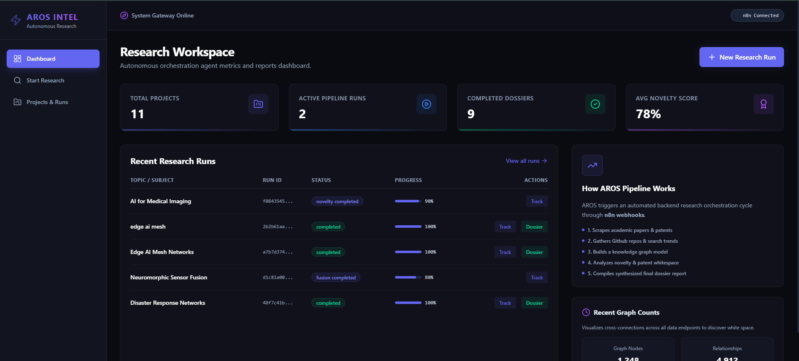
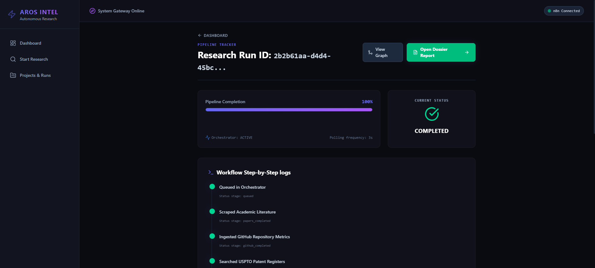
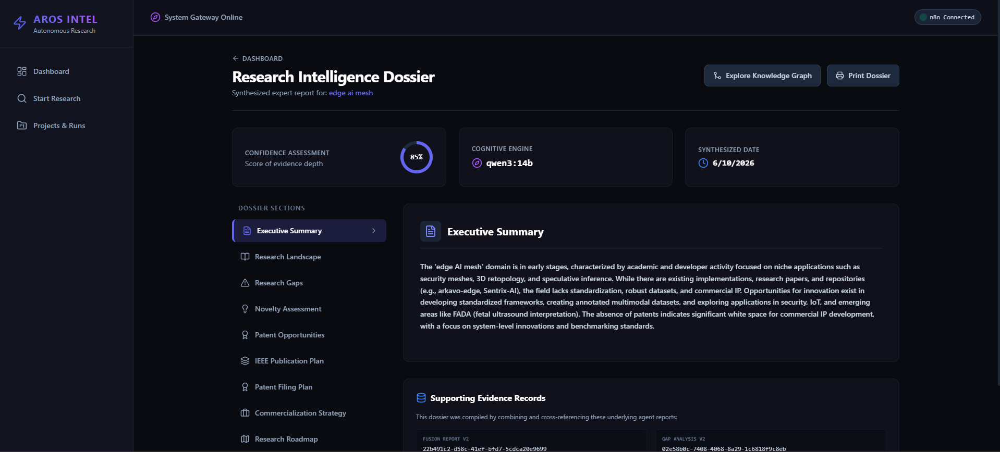
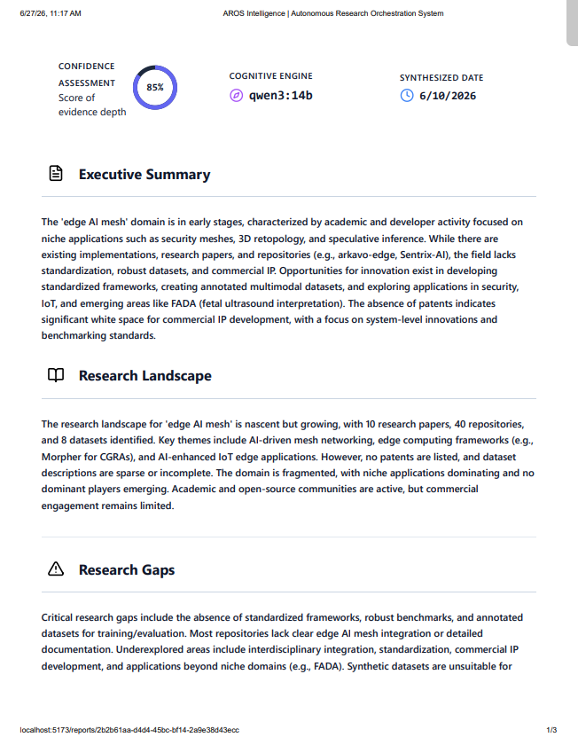
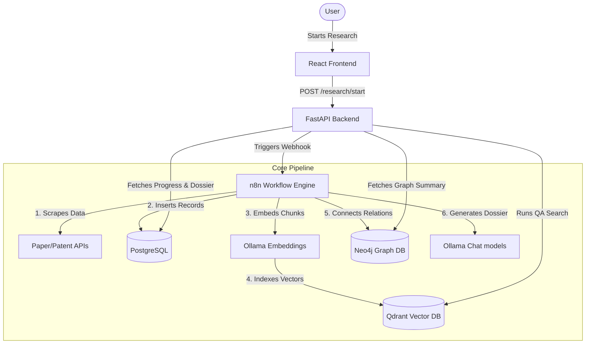

# AROS: Autonomous Research Orchestrator System

[](https://www.python.org/)
[](https://fastapi.tiangolo.com/)
[](https://react.dev/)
[](https://qdrant.tech/)
[](https://neo4j.com/)
[](https://opensource.org/licenses/MIT)

AROS is a professional agentic research platform designed to automate literature discovery, intellectual property (patent) analysis, open-source code indexing, and emerging trend synthesis. It integrates relational, vector, and graph databases to coordinate advanced reasoning agents and generate comprehensive research dossiers.

---

## 📸 Screenshots

Here is a visual walk-through of the AROS Web Interface (dark-themed glassmorphic design):

### 1. Active Research Workspace

*Figure 1: Main Workspace displaying active research runs, task progress, and live resources collected (papers, patents, repositories).*

### 2. Initiating a Research Run

*Figure 2: Form to launch a new agent run with automated semantic query expansions.*

### 3. Projects Management

*Figure 3: Historical archive of all executed research runs, sorting topics, statuses, and links to report generation.*

### 4. Generated Dossier Report

*Figure 4: Synthesized research report containing executive summaries, novelty assessments, publication roads, and patent plans.*

---

## ✨ Features

* **Multi-Provider Search**: Scrapes and queries PatentsView, Lens.org, USPTO, and Europe PMC with automatic fallbacks.
* **Semantic Query Expansion**: Generates 20–50 query variations using LLM reasoning (Qwen) with a rule-based fallback database.
* **LLM Patent Verification**: Validates patent relevance in batch, filtering out edge cases using a strict scoring logic.
* **Knowledge Graph Construction**: Dynamically builds and links entities in Neo4j to analyze centrality (degree metrics).
* **RAG-Powered Q&A**: Indexes research chunks into Qdrant for fast semantic search and instant document Q&A.
* **Glassmorphic UI Dashboard**: Responsive dashboard built in React 19, Vite, and Tailwind CSS.
* **n8n Orchestration**: Integrates n8n to coordinate backend scraping task steps and LLM compilation runs.

---

## 🏗️ Architecture


*For detailed details, read the [Architecture Documentation](docs/architecture.md).*

---

## 🛠️ Technology Stack

* **Frontend**: React (v19), Vite, Tailwind CSS (v4), Axios, Lucide React, Recharts.
* **Backend**: FastAPI (Python 3.12), SQLAlchemy, Uvicorn.
* **Vector DB**: Qdrant, using `nomic-embed-text` embeddings.
* **Graph DB**: Neo4j (via Bolt protocol).
* **Relational DB**: PostgreSQL (v16).
* **Orchestrator**: n8n (SQLite persistence).
* **LLM Engine**: Ollama (Qwen3).

---

## 🚀 Installation & Quick Start

Please check the [Setup Guide](docs/setup.md) for full system requirements.

### 1. Run Docker Containers
Ensure Docker Desktop is running, then run:
```bash
docker-compose up -d
```
This spins up PostgreSQL, Qdrant, Redis, Neo4j, and n8n.

### 2. Setup the Python Backend
```bash
cd src/backend
python -m venv .venv
source .venv/bin/activate  # Or .venv\Scripts\activate on Windows
pip install -r requirements.txt
```

### 3. Initialize Databases
```bash
# PostgreSQL tables
python -m app.database.init_db

# Qdrant collection
python ../../scripts/create_qdrant_collection.py
```

### 4. Start Services
* **FastAPI Server**:
  ```bash
  uvicorn app.main:app --reload --port 8000
  ```
* **React Web App**:
  ```bash
  cd src/frontend
  npm install
  npm run dev
  ```

---

## 📂 Project Structure

```text
├── assets/             # Project visual resources
├── configs/            # Orchestration and configuration templates
├── docs/               # Advanced documentation and test logs
│   ├── assets/         # App view screenshots
│   ├── architecture.md # Backend architecture details
│   ├── setup.md        # Database and model configuration steps
│   ├── n8n_workflows.md# n8n webhook setup
│   └── test_results.md # Test validation outputs
├── examples/           # Request payloads and API schema examples
├── scripts/            # Database utility scripts
├── src/
│   ├── backend/        # FastAPI application (app/, Dockerfile)
│   └── frontend/       # React web app (src/, package.json)
├── tests/              # Scraper and endpoint integration verification tests
├── docker-compose.yml  # Docker multi-container config
└── requirements.txt    # Top-level backend dependencies
```

---

## 💡 Usage Examples

### Starting a Research Run via HTTP request:
```bash
curl -X POST "http://localhost:8000/research/start" \
     -H "Content-Type: application/json" \
     -d '{"topic": "Edge AI Mesh Networks"}'
```
Response:
```json
{
  "run_id": "c6a4c363-4154-4113-b2cd-6322aac270d2",
  "project_id": "204ab934-97e9-4c20-829d-7b0eb93ee6c7",
  "status": "queued"
}
```

---

## ❓ FAQ

#### Q: The frontend shows a blank screen on startup, what is wrong?
A: Check that the backend server is running on port `8000`. The frontend queries the backend on launch to load active projects and run history.

#### Q: How do I activate the n8n webhook?
A: When you start the n8n container, the SQLite database is automatically loaded. Make sure the workflow is set to active. You can check it at `http://localhost:5678`.

---

## 🗺️ Roadmap

- [ ] Add PDF OCR document parsers.
- [ ] Support custom fine-tuned Hugging Face models for validation.
- [ ] Migrate database management to Alembic.
- [ ] Implement multi-tenant user authentication (OAuth2).

---

## 🤝 Acknowledgements

* [n8n](https://n8n.io/) for the node orchestration canvas.
* [Qdrant](https://qdrant.tech/) for their fast vector engine.
* [Neo4j](https://neo4j.com/) for graph path centrality calculations.
