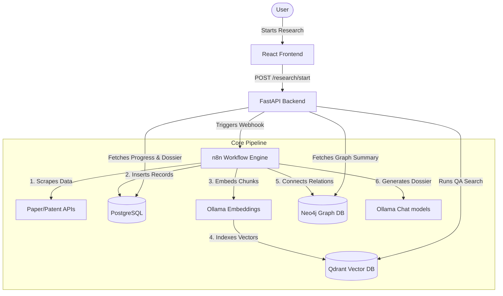

# System Architecture & Data Pipelines

This document details the data structures, indexing pipelines, and service integrations that enable AROS to construct autonomous research dossiers.

---

## 🗺️ Architectural Diagram

---

## 🗄️ Database Architecture

AROS utilizes three distinct database styles to capture different aspects of research entities:

### 1. Relational Database: PostgreSQL
PostgreSQL acts as the system of record for structured facts. Key models include:
* **`Project`**: The research target (e.g., topic name).
* **`ResearchRun`**: Represents an individual execution pipeline, storing status (e.g., `fusion_completed`, `report_completed`) and overall progress metrics.
* **`Paper`**: Scientific literature collected from Semantic Scholar/ArXiv, including title, abstract, local pdf paths, and metadata.
* **`Patent`**: Intellectual property retrieved from PatentsView/USPTO. Features strict validation checks and scoring metrics.
* **`ReportV1`**: The final output dossier compiling next steps, commercial strategies, roadmap, and citation contexts.

### 2. Vector Database: Qdrant
For Retrieval-Augmented Generation (RAG) and question-answering:
* Text documents (papers, patents) are segmented into chunks of text.
* Chunks are encoded via `nomic-embed-text` into 768-dimensional vectors.
* Vector indices reside in the `research_chunks` collection.
* Retrieval queries match query semantics against chunk payloads, returning top documents to contextualize the LLM.

### 3. Graph Database: Neo4j
To analyze citation ecosystems, co-authorship, and cross-patent overlaps:
* Nodes represent entities: `Paper`, `Repository`, `Patent`, `Dataset`, and `Trend`.
* Relationships denote semantic links: `RELATED_TO` based on keyword intersections and citation paths.
* Centrality analysis highlights key papers or repositories that bridge different technologies (e.g., linking a paper to an active GitHub repo).

---

## ⚡ Integration Details

### Scraper API Fallbacks
In [patent_search.py](file:///C:/Users/Porchezhian/Documents/Github%20Local/aros/src/backend/app/services/patent_search.py), requests pass through a tier-based API retrieval fallback system:
1. **Tier 1 (API Keys Required)**: PatentsView / Lens.org / USPTO.
2. **Tier 2 (Scraping)**: Google Patents (fallback JSON endpoints).
3. **Tier 3 (Keyless REST)**: Europe PMC patent records.
This ensures research fetches do not fail even if api credentials are unset.
